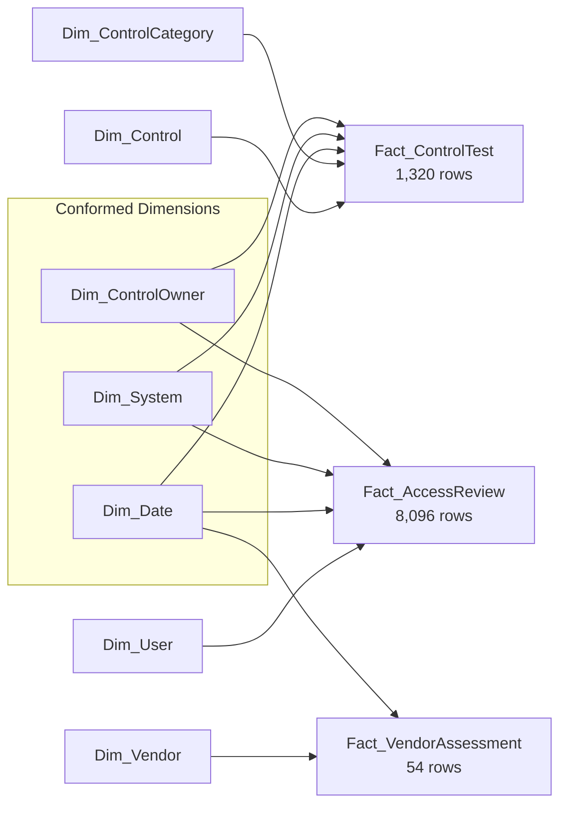

# Technology Controls & Compliance Monitoring

**A Power BI-first GRC / IT-audit analytics project** — a star-schema data model, a fully-explained DAX measure library, and a technology controls & compliance dashboard built over a simulated (but realistically patterned) enterprise dataset: control testing, user access certification, segregation-of-duties conflicts, and third-party vendor risk.

**[Live interactive preview →](https://claude.ai/artifact/71M4HZGNHiZwK43xD1iqGx)** &nbsp;|&nbsp; every number on it is computed from the real dataset in [`/data`](data), not hardcoded.

---

## Why this project

Most portfolio dashboards use a sales, HR, or subscription-revenue dataset. This one is built around what an **IT audit / technology risk / GRC analyst** actually monitors day to day between formal audit cycles:

- Are our controls operating effectively, and where is the exception backlog going stale?
- Are we current on quarterly access recertification, and free of segregation-of-duties conflicts?
- Are our third-party vendors being reassessed on schedule, proportional to their risk?
- If we tightened a compliance SLA, what would actually happen to the backlog — before we change it?

Every visual maps to a decision a CISO, Internal Audit Lead, or GRC Manager would make with it. Full reasoning for that claim is in [`docs/FINDINGS.md`](docs/FINDINGS.md).

## Headline findings

| # | Finding | Number |
|---|---|---|
| 1 | **Change Management** is the weakest control category | 22.8% exception rate (n=250) — nearly 2× the 13.1% overall rate; open items aged **85 days** on average vs. 4 days elsewhere |
| 2 | Legacy **on-prem** systems underperform cloud-native systems | 19.9% vs. 9.8% exception rate (n=396 vs. n=792) |
| 3 | **Orphaned accounts** cluster in manually-deprovisioned systems | 78% of exposure (28 of 36 instances) sits in 2 of 10 systems |
| 4 | **SoD conflicts** are 100% concentrated in Finance systems | 13 distinct users, entirely on SAP ERP + Treasury |
| 5 | Tightening the access-review SLA 30→15 days would spike the backlog | On-time completion drops 77.8% → 46.3%; +2,550 reviews (31%) added overnight |
| 6 | Third-party oversight gaps concentrate in the highest-risk tier | 5 of 25 vendors overdue for reassessment — **all 5** are High-tier |

Full root-cause analysis and recommendations for each: [`docs/FINDINGS.md`](docs/FINDINGS.md).

## Data model

A **galaxy schema** — three fact tables at three different grains, sharing conformed dimensions — rather than one flattened table:



Full grain statements, relationship list, and the modeling trade-offs behind it (why some columns are denormalized onto the fact table, why remediation dates are calculated columns instead of extra relationships): [`docs/DATA_MODEL.md`](docs/DATA_MODEL.md).

## DAX highlights

20+ measures, all in [`docs/DAX_MEASURES.md`](docs/DAX_MEASURES.md) (readable) and [`powerbi/DAX_Measures.dax.txt`](powerbi/DAX_Measures.dax.txt) (copy-paste). Two examples:

```dax
Control Exception Rate % = DIVIDE([Non-Effective Tests], [Total Control Tests])

Orphaned Accounts (Distinct Users) =
CALCULATE(DISTINCTCOUNT(Fact_AccessReview[UserKey]), Fact_AccessReview[IsOrphanedAccount] = TRUE())
```

`DIVIDE()` instead of `/` because several heat-map cells legitimately have zero tests (some categories are tested semi-annually). `DISTINCTCOUNT` instead of `COUNTROWS` because the same terminated employee can be flagged orphaned across multiple quarterly cycles before deprovisioning — counting rows would triple-count one person.

## What-if parameter: Access Review SLA

The project's risk-lever requirement: a Power BI **What-If Parameter** (disconnected table + `SELECTEDVALUE()`) that models tightening the access-review SLA from 30 to 15 days — holding every reviewer's actual historical completion time fixed and re-classifying the same 8,096 reviews against a stricter policy line. Try it live in the [interactive preview](https://claude.ai/artifact/71M4HZGNHiZwK43xD1iqGx); the mechanics are fully explained in [`docs/DAX_MEASURES.md`](docs/DAX_MEASURES.md#section-5--what-if-parameter-access-review-sla-30--15-days).

## Repo structure

```
.
├── data/                        # 10 CSVs: the star schema, source of truth
├── powerbi/
│   ├── GRC_Tech_Controls_Dataset.xlsx   # ready for Power BI "Get Data → Excel"
│   └── DAX_Measures.dax.txt             # every measure, copy-paste ready
├── docs/
│   ├── index.html                # interactive dashboard preview (GitHub Pages entry point)
│   ├── DATA_MODEL.md             # schema, grains, relationships, ERD
│   ├── DAX_MEASURES.md           # annotated DAX library
│   ├── FINDINGS.md               # 6 findings, numbers-first, with recommendations
│   ├── INTERVIEW_NOTES.md        # concept primers + anticipated Q&A
│   └── ASSUMPTIONS.md            # what's simplified, and why
└── scripts/
    ├── generate_dataset.py       # builds the entire dataset from a fixed seed
    └── analyze_findings.py       # computes every number cited in FINDINGS.md
```

## Reproduce it

```bash
git clone https://github.com/<your-username>/tech-controls-compliance-dashboard.git
cd tech-controls-compliance-dashboard
pip install -r scripts/requirements.txt
python scripts/generate_dataset.py     # rebuilds data/*.csv from seed 42
python scripts/analyze_findings.py     # rebuilds docs/findings_stats.json
```

Then open `powerbi/GRC_Tech_Controls_Dataset.xlsx` in Power BI Desktop and follow [`docs/ASSUMPTIONS.md`](docs/ASSUMPTIONS.md#why-theres-no-pbix-file-in-this-repo) to build the report.

## Skills demonstrated

`Star/galaxy schema design` · `DAX (CALCULATE, DIVIDE, DISTINCTCOUNT, AVERAGEX, FILTER, ALL, SELECTEDVALUE)` · `Power BI What-If Parameters` · `Data modeling trade-offs (grain, denormalization, role-playing dimensions)` · `Python (pandas/numpy) synthetic data generation with controlled statistical properties` · `IT/SOX control concepts (SoD, remediation aging, control testing, ITGC)` · `Third-party/vendor risk tiering` · `Root-cause analysis and audit-style findings writing`

## License

[MIT](LICENSE) — the code and documentation are free to reuse; the dataset is synthetic and carries no real-world data.
