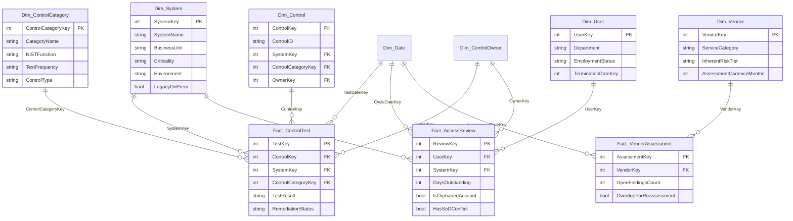

# Data Model — Star (Galaxy) Schema

The model is a **galaxy schema**: three fact tables at three different grains, sharing a set of conformed dimensions. That choice is deliberate — control testing, access review, and vendor risk are genuinely different business processes with different grains, but they need to answer cross-cutting questions together ("which systems are weak on both control testing *and* access review?"), which is only possible if they share the same `Dim_System`, `Dim_Date`, and `Dim_ControlOwner` rather than each carrying its own copy.

## Fact tables — grain statements

Being able to state the grain of a fact table in one sentence is the fastest way to prove you understand a data model, so each one is stated explicitly:

| Fact table | Grain | Rows |
|---|---|---|
| `Fact_ControlTest` | One row per **control** per **test date** | 1,320 |
| `Fact_AccessReview` | One row per **user** per **system** per **quarterly certification cycle** | 8,096 |
| `Fact_VendorAssessment` | One row per **vendor** per **risk-assessment event** | 54 |

**`Fact_ControlTest`** — each row is a single control-testing event: was this one control effective on this one test date. `TestResult` is `Pass` / `Exception` / `Fail`. Non-pass rows carry an `ExceptionSeverity` (Critical/High/Medium/Low, which sets the remediation due date), a `RemediationStatus` (Open/In Progress/Closed/N-A), and the dates the finding was opened, was due, and (if applicable) closed.

**`Fact_AccessReview`** — each row is one reviewer's certification decision for one user's access to one system in one quarterly cycle. `DaysOutstanding` is populated for *every* row — actual days-to-complete for a finished review, elapsed days-so-far for one still open — which is what makes a single column usable for both on-time-rate and backlog measures without survivorship bias (see [DAX_MEASURES.md](DAX_MEASURES.md#4-on-time--without-survivorship-bias)). `IsOrphanedAccount` and `HasSoDConflict` are row-level risk flags evaluated at that cycle.

**`Fact_VendorAssessment`** — each row is one point-in-time risk assessment of one vendor: findings counts, inherent and residual risk tier at that assessment, and whether that assessment is the vendor's current (`IsLatestAssessment`) record.

## Dimension tables

| Table | Rows | Key attributes |
|---|---|---|
| `Dim_Date` | 1,186 | `Date`, `Year`, `Quarter`, `YearQuarter`, `IsWeekend` |
| `Dim_System` | 10 | `BusinessUnit`, `Criticality`, `Environment`, `LegacyOnPrem` |
| `Dim_ControlCategory` | 8 | `NISTFunction`, `TestFrequency`, `ControlType` |
| `Dim_ControlOwner` | 8 | `OwnerName`, `Department` |
| `Dim_Control` | 80 | `ControlID`, `ControlName`, `TestFrequency`, `ControlType` |
| `Dim_User` | 500 | `Department`, `JobTitle`, `EmploymentStatus`, `TerminationDateKey` |
| `Dim_Vendor` | 25 | `ServiceCategory`, `InherentRiskTier`, `AssessmentCadenceMonths` |

## Relationships to build in Power BI (Model view)

All relationships are 1-to-many, single filter direction, from dimension → fact.

| From (dimension) | To (fact) |
|---|---|
| `Dim_Date[DateKey]` | `Fact_ControlTest[TestDateKey]` — **active** |
| `Dim_Date[DateKey]` | `Fact_AccessReview[CycleDateKey]` — **active** |
| `Dim_Date[DateKey]` | `Fact_VendorAssessment[AssessmentDateKey]` — **active** |
| `Dim_System[SystemKey]` | `Fact_ControlTest[SystemKey]` / `Fact_AccessReview[SystemKey]` |
| `Dim_ControlCategory[ControlCategoryKey]` | `Fact_ControlTest[ControlCategoryKey]` |
| `Dim_ControlOwner[OwnerKey]` | `Fact_ControlTest[OwnerKey]` / `Fact_AccessReview[OwnerKey]` |
| `Dim_Control[ControlKey]` | `Fact_ControlTest[ControlKey]` |
| `Dim_User[UserKey]` | `Fact_AccessReview[UserKey]` |
| `Dim_Vendor[VendorKey]` | `Fact_VendorAssessment[VendorKey]` |

> **Modeling decision worth defending:** `Fact_ControlTest` also carries `SystemKey` and `ControlCategoryKey` directly, even though `Dim_Control` already links to both. This is an intentional denormalization, not an oversight — it lets the risk heat map filter and group by System and Category without forcing every query through `Dim_Control`, and it keeps `Dim_Control`'s own relationship path (`Dim_Control → Fact_ControlTest` on `ControlKey`) as the only path used for control-level lookups, so there is no ambiguous multi-path filter propagation.

## Why three date roles on `Fact_ControlTest` are not three relationships

`Fact_ControlTest` has `TestDateKey`, `RemediationOpenDateKey`, `RemediationDueDateKey`, and `RemediationCloseDateKey` — four distinct dates, but only **one** active relationship to `Dim_Date` (on `TestDateKey`). Adding three more relationships to the same date table would force `USERELATIONSHIP()` into every aging measure and creates a real risk of silently filtering on the wrong date role. Instead, the three remediation dates become plain calculated Date columns via `LOOKUPVALUE()` against `Dim_Date`, used only inside `DATEDIFF()` expressions — never for slicing a visual by a "Remediation Date" hierarchy. The exact DAX is in [DAX_MEASURES.md, Section 0](DAX_MEASURES.md#section-0--calculated-columns-build-these-first).
